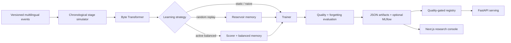
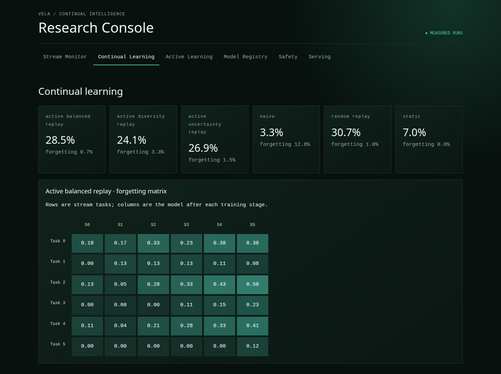

# VelaCL

**Live measured dashboard:** https://wimpie007120606.github.io/VelaCL/

VelaCL is a reproducible research system for studying how a multilingual intent model can learn from a chronological enterprise-data stream without forgetting earlier languages and domains. It combines a real byte-level Transformer, continual-learning experiments, active sample selection, artifact lineage, serving, and a dashboard in one small repository.

The first release is intentionally runnable on CPU. It does **not** claim that its project-owned fixture represents real customer traffic, that the model is production-ready, or that distributed/quantized performance has been measured.

## Research questions

1. How much does naive sequential fine-tuning forget after language and intent shifts?
2. Does replay retain prior tasks better under a fixed memory budget?
3. Can uncertainty, embedding diversity, language scarcity, intent novelty, forgetting risk, and safety importance select a more useful balanced memory?
4. What quality/calibration trade-offs appear by language and domain?

## Architecture



## Dataset and stream

`make data` creates a deterministic JSONL fixture with stable IDs, timestamps, stages, splits, language, domain, intent, difficulty, source, annotation state, and privacy/safety flags. The six stages introduce English/Afrikaans support, payments, isiZulu, security, isiXhosa/Sesotho, then policy changes. See [DATA_CARD.md](DATA_CARD.md) for provenance and limitations.

## Methods

- **Static:** trains at stage 0 and never updates.
- **Naive:** trains only on the newest stage.
- **Random replay:** adds a fixed random memory of prior events.
- **Active balanced replay:** scores incoming data, trains on an eight-example-per-stage annotation-budget subset plus memory, then balances memory by language/intent.
- **Ablations:** uncertainty-only and diversity-only selection use the same model, budget, stage order and memory policy.

The model is a compact byte-level Transformer encoder. Byte tokenization makes every UTF-8 language representable without downloading a vocabulary. This is a systems research model, not MzansiLM-125M; plugging in that checkpoint is a roadmap item because V1 must remain reproducible on ordinary hardware.

## Reproduce

```bash
python3 -m venv .venv
. .venv/bin/activate
pip install -e '.[dev]'
make data
make experiment            # runs all four methods and promotes a gated champion
make test
make api                   # http://localhost:8000/docs
make dashboard             # http://localhost:3000
```

Resume a particular method from an interrupted stage:

```bash
velacl-train --method naive --resume experiments/runs/naive/stage-2.pt
```

Every run records configuration, seed, dataset SHA-256, Git commit, hardware, duration, per-stage metrics, checkpoint paths, and promotion status. Install `.[tracking]` to mirror parameters and metrics into local MLflow.

## Results

Results in `experiments/runs/summary.json` are generated by `make experiment`, never hard-coded. In the checked reference run, random replay reached 30.66% average task macro-F1 with 1.00% forgetting; active balanced replay reached 28.53% with 0.69% forgetting under the eight-example stage budget. A full table and ablations are in [reports/TECHNICAL_REPORT.md](reports/TECHNICAL_REPORT.md). Results are seed-42 fixture measurements, not claims about production or African-language NLP generally.

## API example

```bash
curl -s http://localhost:8000/v1/predict \
  -H 'content-type: application/json' \
  -d '{"texts":["sawubona, ngidinga usizo"],"model_version":"champion"}'
```

The service supplies batched structured predictions, confidence scores, version selection, lightweight language/risk signals, SSE streaming, validation, rate limiting, readiness, Prometheus metrics, and registry-based rollback metadata.

## Dashboard

The Next.js console has Stream Monitor, Continual Learning, Active Learning, Registry, Safety, and Serving tabs. It visualizes the measured forgetting matrix, language results, selection queue and model lineage. Safety/load tabs explicitly withhold numbers until representative evaluations are run.

Screenshot generation is reproducible after starting both services:

```bash
make screenshot
```



## Limitations and ethics

The fixture is tiny, translated/curated by the project, and cannot establish linguistic fairness. Intent labels are much narrower than real enterprise language. The active selector uses gold correctness to simulate forgetting risk; a deployed pool would replace this with held-out drift signals or reviewer feedback. Privacy flags are metadata, not a certified PII system. Model confidence is not decision safety. No automated prediction should determine access to financial or public services. See [MODEL_CARD.md](MODEL_CARD.md) and [DATA_CARD.md](DATA_CARD.md).

## Demo video

A video is not bundled because a generated stand-in would be misleading. [reports/DEMO_SCRIPT.md](reports/DEMO_SCRIPT.md) gives a two-minute, artifact-backed recording script.

## Roadmap

- Replace the fixture with license-verified MzansiText/INJONGO/MASSIVE subsets.
- Compare a pretrained multilingual classifier and MzansiLM-125M.
- Repeat seeds and add confidence intervals and annotation-budget ablations.
- Run DDP/FSDP scaling on named hardware; add multilingual safety judgments.
- Benchmark quantized/vLLM serving, then add teacher distillation and JAX comparison.

Apache-2.0 licensed. Dataset content has separate project-owned terms described in the data card.
